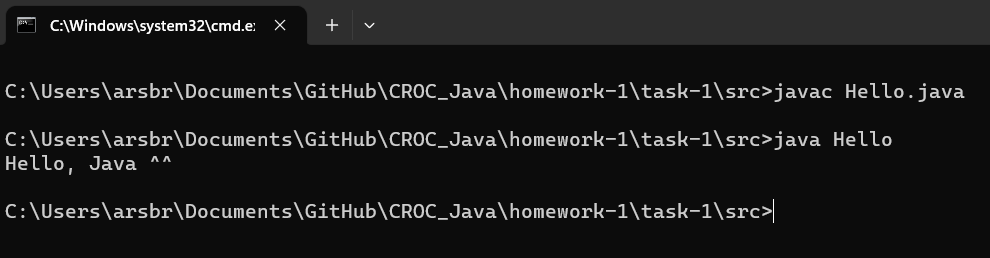

## Задание 1 | Hello
### Условие:
Начнём с простой разминки
Реализуйте программу, которая бы выводила на экран текст ‘Hello, Java ^^’
### Решение
```public class Hello {
    public static void main(String[] args) {
        System.out.println("Hello, Java ^^");
    }
}
```
