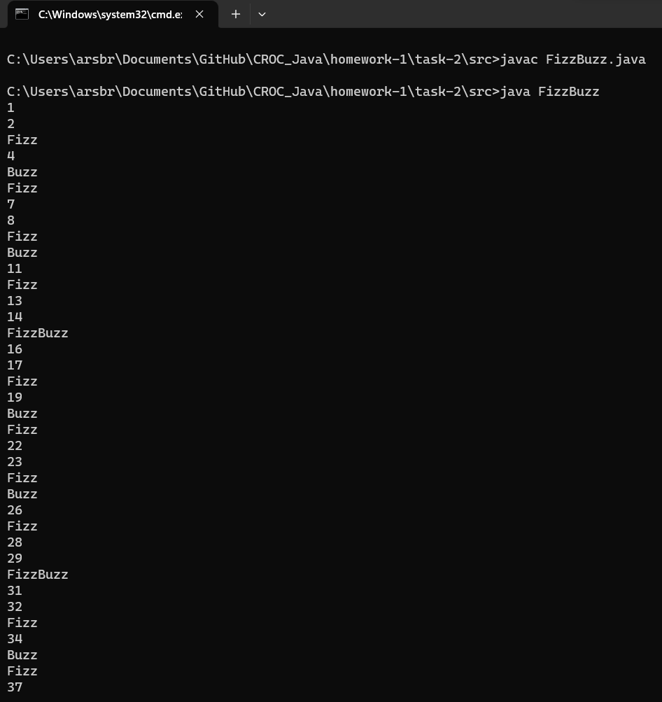

## Задание 2 | FizzBuzz
### Условие:
Напишите короткую программу, которая выводит на экран числа от 1 до 100, каждое в новой строке.
Вместо каждого числа, которое делится на 3, выводите ‘Fizz’.
Вместо каждого числа, которое делится на 5, выводите ‘Buzz’.
Вместо каждого числа, которое делится и на 3, и на 5, выводите ‘FizzBuzz’.
### Решение
```
package ArturKuznetsov.lab1.task2;

public class FizzBuzz {
    public static void main(String[] args) {
        for (int i = 1; i <= 100; i++) {
            if (i % 3 == 0 && i % 5 == 0) {
                System.out.println("FizzBuzz");
            } else if (i % 3 == 0) {
                System.out.println("Fizz");
            } else if (i % 5 == 0) {
                System.out.println("Buzz");
            } else {
                System.out.println(i);
            }
        }
    }
}
```
