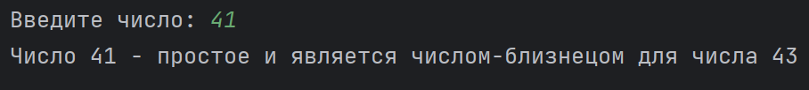

## Задание 3 | Простые числа
### Условие:
Напишите программу, которая для заданного числа от 2 до 10^10 (10 000 000 000) проверит является ли это число простым. Вывести на экран “Простое” или “Составное” число.
*  проверить является ли число - числом-близнецом

### Решение
```
package ArturKuznetsov.lab2.task3;

import java.util.Scanner;

public class PrimeNumber {
    public static void main(String[] args) {

        PrimeChecker prime = new PrimeChecker();

        Scanner in = new Scanner(System.in);
        System.out.print("Введите число: ");
        long number = in.nextLong();
        in.close();

        if (prime.IsPrime(number) && prime.IsPrime(number-2)) {
            System.out.printf("Число %d - простое и является числом-близнецом для числа %d\n", number, number-2);

        } else if (prime.IsPrime(number) && prime.IsPrime(number+2)) {
            System.out.printf("Число %d - простое и является числом-близнецом для числа %d\n", number, number+2);

        } else if (prime.IsPrime(number)) {
            System.out.printf("Число %d - простое\n", number);

        } else {
            System.out.printf("Число %d - составное\n", number);

        }
    }

}
```
```
package ArturKuznetsov.lab2.task3;

import static java.lang.Math.sqrt;

public class PrimeChecker {
    public boolean IsPrime(long num) {
        if (num > 1) {
            for (long i = 2; i <= sqrt(num); i++) {
                if (num % i == 0) {
                    return false;
                }
            }
            return true;
        } else {
            return false;
        }
    }
}
```
