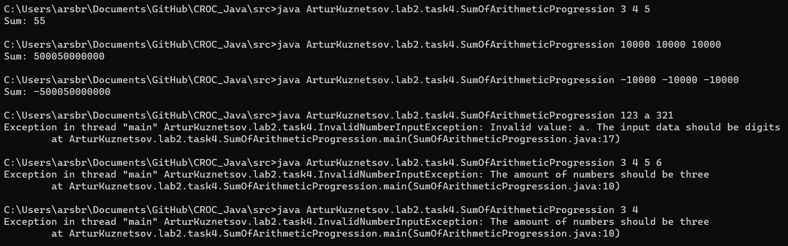

## Задание 4 | Сумма арифметической прогрессии
### Условие:
Написать программу, которая принимает 3 аргумента, и считает сумму арифметической прогрессии.
Аргументы: начальный элемент, разность арифметической прогрессии и кол-во членов прогрессии. Каждое число от -10 000 до +10 000
Решить с помощью использования циклов, а не формулы суммы.
### Решение
```
package ArturKuznetsov.lab2.task4;

import java.util.Scanner;

public class SumOfArithmeticProgression {
    public static void main(String[] args) {

        Scanner in = new Scanner(System.in);
        System.out.print("Введите числа: ");
        int initialElement = in.nextInt();
        int progressionDifference = in.nextInt();
        int numberOfTerms = in.nextInt();
        in.close();

        int sumOfProgression = 0;
        for (int i = 0; i < numberOfTerms; i++) {
            sumOfProgression += initialElement + i * progressionDifference;
        }
        System.out.printf("Сумма: %d\n", sumOfProgression);
    }
}
```
