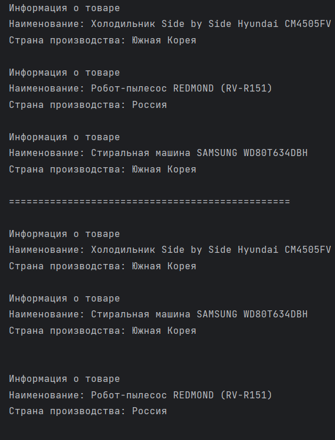
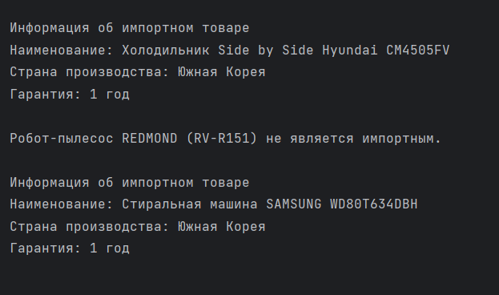

## Задание 5 | Каталог интернет-магазина
### Условие:
Поступил заказ на написание интернет магазина для бытовых приборов.
Ваша часть задачи - реализовать классы - отвечающие за ассортимент магазина.
(Такие как холодильник (мини холодильник, с морозильной камерой или без), плита (газовая, электро, индукционная), стиралка (может быть с сушилкой), робот пылесос, и насколько фантазии хватит)

Определите набор характеристик каждого товара. Такие как цена, описание товара, габариты, мощность, время автономной работы от аккумулятора, температура морозильной камеры)

Добавьте позиции с общий массив.
Для всех элементов выведите на экран их характеристики в читаемом виде.
Определите методы для установки/получения характеристик.
Для импортных товаров реализуйте методы возвращающие наличие гарантии от производителя и страну производства.

### Решение
```
package ArturKuznetsov.lab3.task5;

import ArturKuznetsov.lab3.task5.builders.FridgeBuilder;
import ArturKuznetsov.lab3.task5.builders.RobotVacuumCleanerBuilder;
import ArturKuznetsov.lab3.task5.builders.WashingMachineBuilder;
import ArturKuznetsov.lab3.task5.director.Director;
import ArturKuznetsov.lab3.task5.exceptions.InvalidValueException;
import ArturKuznetsov.lab3.task5.exceptions.NotImportedProductException;

public class Main {
    public static void main(String[] args) throws NotImportedProductException, InvalidValueException {
        Director director = new Director();

        var fridgeBuilder = new FridgeBuilder();
        var robotVacuumCleanerBuilder = new RobotVacuumCleanerBuilder();
        var washingMachineBuilder = new WashingMachineBuilder();

        director.constructHyundaiFridge(fridgeBuilder);
        director.constructRedmondRobotVacuumCleaner(robotVacuumCleanerBuilder);
        director.constructSamsungWashingMachine(washingMachineBuilder);

        var fridge = fridgeBuilder.build();
        var robotVacuumCleaner = robotVacuumCleanerBuilder.build();
        var washingMachine = washingMachineBuilder.build();

        var catalog = new Catalog();
        catalog.addProduct(fridge);
        catalog.addProduct(robotVacuumCleaner);
        catalog.addProduct(washingMachine);

        catalog.showAllCatalog();

        System.out.println("================================================\n");

        catalog.showFirstImportedThenLocal();

        System.out.println("================================================\n");

        System.out.println(fridge.getImportProductDetails());
        System.out.println(robotVacuumCleaner.getImportProductDetails());
        System.out.println(washingMachine.getImportProductDetails());

    }
}
```


