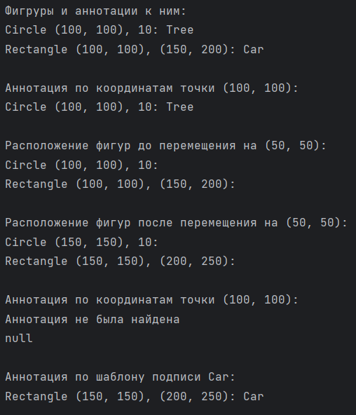

## Задание 6 | Аннотирование изображений
### Условие:
Предположим, вы принимаете участие в разработке небольшого приложения по аннотированию (разметке) изображений с целью последующего использования этой разметки для обучения моделей computer vision. В этом приложении пользователь может выделять области на изображении с помощью прямоугольников и окружностей и подписывать их произвольным текстом.
Вся разметка для изображения представляется массивом `Annotation[]`.

В приложении определен класс аннотированного изображения:

```
class AnnotatedImage {

   private final String imagePath;

   private final Annotation[] annotations;

   public AnnotatedImage(String imagePath, Annotation... annotations) {
       this.imagePath = imagePath;
       this.annotations = annotations;
   }

   public String getImagePath() {
       return this.imagePath;
   }

   public Annotation[] getAnnotations() {
       return this.annotations;
   }
}
```

Определите класс `Annotation` для представления данных разметки (данные: подпись и фигура) и классы `Figure`,`Rectangle`,`Circle` для задания размеченных областей.

Прямоугольники определяются координатами левого нижнего и правого верхнего углов, а окружности - координатами центра и радиусом.

Переопределите метод `toString()` класса `Annotation` так, чтобы в результат выводилась информация о полях и вложенных объектах. Формат вывода:


Окружность:

“Circle (x0, y0), r: Подпись”

Прямоугольник:

“Rectangle (x1, y1), (x2, y2): Подпись”

Например:
```
Circle (100, 100), 10: Tree
Rectangle (100, 100), (150, 200): Car
```

Так же от пользователей пришел запрос на возможность перемещать уже размеченные области. Для поддержки это функциональности вам требуется реализовать:

1. **Выбор аннотации по координатам точки (x, y);**

В массиве аннотаций требуется найти первую, фигура которой содержит точку с заданными координатами.

```
Annotation findByPoint(int x, int y) {

// ...

}
```

2. **Выбор аннотации по шаблону подписи;**

В массиве аннотаций требуется найти первую, подпись которой содержит заданную подстроку.

```
Annotation findByLabel(String label) {

// ...

}
```

Определить, содержит ли строка заданную подстроку, можно с помощью метода contains(CharSequence s) класса String.

3. **Перемещение фигуры выбранной аннотации на смещение (dx, dy);**

В рамках этого изменения вы решили доработать классы фигур таким образом, чтобы они реализовывали интерфейс

```
public interface Movable {

void move(int dx, int dy);

}
```

Разработайте классы и реализуйте соответствующие методы.
### Решение
```
package ArturKuznetsov.lab3.task6;

import ArturKuznetsov.lab3.task6.exceptions.AnnotationNotFoundException;
import ArturKuznetsov.lab3.task6.exceptions.IncorrectCoordinatesException;
import ArturKuznetsov.lab3.task6.exceptions.InvalidValueException;
import ArturKuznetsov.lab3.task6.figures.Circle;
import ArturKuznetsov.lab3.task6.figures.Rectangle;

public class Main {
    public static void main(String[] args) throws InvalidValueException, IncorrectCoordinatesException, AnnotationNotFoundException {
        Circle circle = new Circle(100, 100, 10);
        Rectangle rectangle = new Rectangle(100, 100, 150, 200);

        Annotation annotation1 = new Annotation(circle, "Tree");
        Annotation annotation2 = new Annotation(rectangle, "Car");

        AnnotatedImage image = new AnnotatedImage("example", annotation1, annotation2);

        int x = 100;
        int y = 100;
        Annotation foundByPoint = image.findByPoint(x, y);
        System.out.println(foundByPoint);

        String labelToFind = "Car";
        Annotation foundByLabel = image.findByLabel(labelToFind);
        System.out.println(foundByLabel);
    }
}
```

