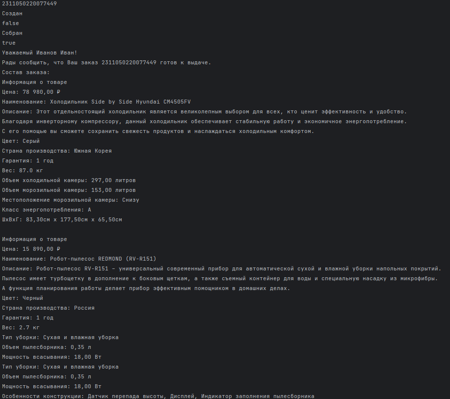
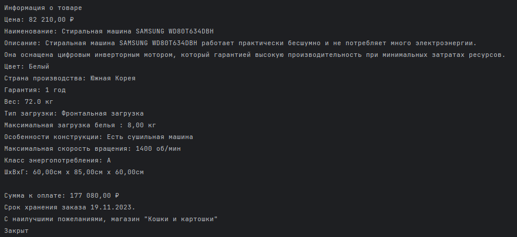

## Задание 7 | Заказ из интернет-магазина
### Условие:
В задании 5 вы начали разработку интернет-магазина.

Вашей задачей было реализовать классы, отвечающие за ассортимент магазина. 

Увы, команда, которая должна была разработать классы, отвечающие за заказы, провалила задание, так что теперь вам придётся взять эту часть на себя.

Определите набор характеристик класса `Order`. Заказчик (директор магазина) считает важным хранить номер, дату/время поступления, дату/время сборки, дату/время получения и состав заказа, а также ФИО и номер телефона клиента.

Ожидается, что **состав заказа и дата/время его поступления не меняются** с момента его создания.

Заказчик просит формировать номер заказа следующим образом:

*<год - 2 последних цифры><месяц - 2 цифры><день - 2 цифры><часы - 2 цифры><минуты - 2 цифры><секунды - 2 цифры><4 последних цифры номера телефона заказчика>*

То есть, для заказа, созданного 25.10.2023 в 19:50:25 клиентом с номером телефона +79990002545 номер будет **2310251950252545.**

К сожалению, у магазина есть некоторые проблемы с логистикой и площадями для хранения, так что **размер заказа ограничен 75 позициями**.

Другая команда разрабатывает модуль для отправки уведомлений клиентам. Тимлид этой команды связался с вами и обсудил возможность формирования уведомления следующего вида:

> Уважаемый <имя клиента>!
> 
> Рады сообщить, что Ваш заказ <номер заказа> готов к выдаче.
> 
> Состав заказа:
> 
> <список товаров с важными характеристиками, каждый товар в новой строке>
>
> Сумма к оплате: <сумма заказа, 2 знака после запятой>₽
> 
> Срок хранения заказа <дата сборки + 2 недели, формат вывода даты 25.10.2023>.
> 
> С наилучшими пожеланиями, магазин “Кошки и картошки”

Вы ответили, что всё реализуете в лучшем виде, ведь недавно вы как раз проходили тему форматирования всего и вся, в том числе валют.

Так как время хранения заказа ограничено (2 недели с момента сборки), ещё одна команда разрабатывает модуль, который позволяет клиенту проверить возможность получения заказа.

Архитектор команды просит вас добавить метод, который бы работал по следующей логике:

- если заказ пока не собран, то получение недоступно, метод возвращает **false**,
- если заказ уже собран и срок его хранения пока не вышел, то заказ доступен для получения, метод возвращает **true**,
- если заказ собран, но срок хранения истёк, то метод бросает **исключение**.

Эта же команда разрабатывает рабочую панель для сотрудника зоны выдачи заказов, так что архитектор предложил вам добавить поле со статусом заказа, в качестве набора значений он предлагает использовать следующее перечисление:

```
public enum OrderStatus {
CREATED,
COLLECTED,
EXPIRED,
CLOSED
}
```

От вас требуются методы, которые позволят:

- заказ “собрать”,
- заказ “выдать”,
- проверить не истёк ли срок хранения заказа и, если истёк, установит ему соответствующий статус.

Архитектор обещает, что напишет джобу по расписанию, которая будет проходиться по всем актуальным заказам в базе и опрашивать их на истечение сроков хранения, используя ваш метод.

**Чтобы смежные команды могли приступить к разработке как можно скорее, они просят вас предоставить им соответствующие интерфейсы.**
### Решение
```
package ArturKuznetsov.lab4.task7;

import ArturKuznetsov.lab3.task5.builders.FridgeBuilder;
import ArturKuznetsov.lab3.task5.builders.RobotVacuumCleanerBuilder;
import ArturKuznetsov.lab3.task5.builders.WashingMachineBuilder;
import ArturKuznetsov.lab3.task5.director.Director;
import ArturKuznetsov.lab3.task5.exceptions.InvalidValueException;
import ArturKuznetsov.lab3.task5.products.Product;
import ArturKuznetsov.lab4.task7.enums.Gender;
import ArturKuznetsov.lab4.task7.exceptions.InvalidCustomerData;
import ArturKuznetsov.lab4.task7.exceptions.InvalidOrderSize;
import ArturKuznetsov.lab4.task7.exceptions.InvalidPhoneNumberException;
import ArturKuznetsov.lab4.task7.exceptions.OrderStatusExpection;

import java.time.LocalDateTime;
import java.util.ArrayList;

public class Main {
    public static void main(String[] args) throws InvalidValueException, InvalidPhoneNumberException, InvalidCustomerData, InvalidOrderSize, OrderStatusExpection {
        Director director = new Director();

        var fridgeBuilder = new FridgeBuilder();
        var robotVacuumCleanerBuilder = new RobotVacuumCleanerBuilder();
        var washingMachineBuilder = new WashingMachineBuilder();

        director.constructHyundaiFridge(fridgeBuilder);
        director.constructRedmondRobotVacuumCleaner(robotVacuumCleanerBuilder);
        director.constructSamsungWashingMachine(washingMachineBuilder);

        var fridge = fridgeBuilder.build();
        var robotVacuumCleaner = robotVacuumCleanerBuilder.build();
        var washingMachine = washingMachineBuilder.build();

        ArrayList<Product> orderList = new ArrayList<>();
        orderList.add(fridge);
        orderList.add(robotVacuumCleaner);
        orderList.add(washingMachine);

        LocalDateTime createdDateTime = LocalDateTime.now();

        Client client = new Client("+7 (912) 421-74-49","Иванов", "Иван",null, Gender.MALE);
        Order order = new Order(createdDateTime, orderList, client);

        System.out.println(order.getId());

        System.out.println(order.getStatus());
        System.out.println(order.canGetOrder());

        order.collectOrder();
        System.out.println(order.getStatus());
        System.out.println(order.canGetOrder());

        order.closeOrder();
        System.out.println(order.getStatus());
    }
}
```


