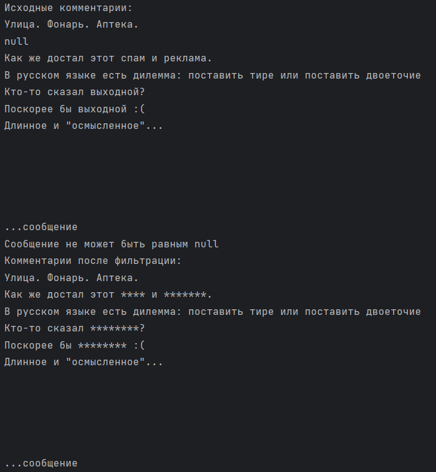

## Задание 9 | Черный список
### Условие:
Небольшой стартап разрабатывает социальный сервис, в котором пользователи могут оставлять комментарии. Со временем в комментариях появился спам и разработчики решили бороться с ним с помощью "черных списков" запрещенных слов. Они составили такие списки и поручили вам написать функцию, удаляющую из всех накопленных комментариев нежелательные.

Они предоставили вам интерфейс, который внедрили в свой продукт, и попросили написать его реализацию:

```java
import java.util.List;
import java.util.Set;

public interface BlackListFilter {

/**
* From the given list of comments removes ones
* that contain words from the black list.
*
* @param comments list of comments; every comment
*                 is a sequence of words, separated
*                 by spaces, punctuation or line breaks
* @param blackList list of words that should not
*                  be present in a comment
*/

void filterComments(List<String> comments, Set<String> blackList);

}
```

Реализуйте интерфейс BlackListFilter.

В методе main покажите вариант использования вашего фильтра.

Задача со *:

Доп сложности:

1. Надо не удалить комментарий, а заменить грязные слова на звёздочки.
2. Если слово написано с одной опечаткой - его также замаскировать
### Решение
```
package ArturKuznetsov.lab5.task9;

import java.util.ArrayList;
import java.util.List;
import java.util.Set;

public class Main {
    public static void main(String[] args) {
        BlackListFilter blackListFilter = new BlackListFilter();

        List<String> comments = new ArrayList<>();
        comments.add("Улица. Фонарь. Аптека.");
        comments.add(null);
        comments.add("Как же достал этот спам и реклама.");
        comments.add("В русском языке есть дилемма: поставить тире или поставить двоеточие");
        comments.add("Кто-то сказал выходной?\nПоскорее бы выходной :(");
        comments.add("Длинное и \"осмысленное\"...\n\n\n\n\n\n...сообщение");

        Set<String> blackList = Set.of("спам", "реклама", "выходной");

        System.out.println("Исходные комментарии:");
        for (String comment : comments) {
            System.out.println(comment);
        }

        blackListFilter.filterComments(comments, blackList);

        System.out.println("Комментарии после фильтрации:");
        for (String comment : comments) {
            System.out.println(comment);
        }
    }
}
```

